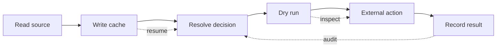

---

## layout: post

title: "A Script Is Not Automation Until It Can Be Interrupted"
date: 2026-04-29
description: "Crash-resistant automation comes from state, slices, dry runs, and boring recovery paths."
tags: [automation, reliability, launchd]

The happy path is not the automation.

The automation is what happens after the laptop sleeps, the token expires, the app permission prompt opens behind another window, or the network call returns something the parser has never seen before.

That is where most personal automation falls apart. Not because the idea was bad. Because the script assumed it would get to finish.

## The bug is the shape

A lot of scripts begin as a single satisfying line of thought:

1. read the source
2. transform the data
3. call the API
4. update the state
5. send the thing

That is fine for a prototype. It is dangerous as the final shape.

Once a script handles permissions, parsing, network I/O, retries, side effects, and state updates in one run, every step inherits every other step’s failure mode. A slow source blocks the send. A bad send corrupts the state. A state write fails after the external action already happened. A retry repeats the one part that should never repeat.

The script does too much, so it cannot tell you what happened.

## Smaller pieces are not just cleaner

The fix is not “write better code.” The fix is to make the work interruptible.




Each box should be able to fail without making the whole system mysterious.

A cache is not an optimization here. It is a recovery point. A dry run is not a nicety. It is the line between “I know what would happen” and “I hope this external action is right.” A result record is not bookkeeping. It is how the next run avoids pretending nothing happened.

## What crash-resistant really means

Crash-resistant automation does not mean nothing crashes.

It means a crash leaves evidence.

A good run should be able to answer:

- What input did I read?
- What decision did I make?
- What external action did I take?
- What proof do I have?
- Where can I safely resume?

If the answer lives only in stdout from a process that already died, the system is not durable. It is theater.

This is especially true for agents. An agent can sound confident after losing the thread. It can say “still running” when nothing is running. It can say “done” because the plan reached the end of the sentence. The antidote is not a better pep talk. It is state the agent has to touch.

## The boring pattern

For personal automation, I like this default:

```text
source -> cache -> decide -> dry-run -> act -> record
```

Then wrap it with a scheduler only after the pieces are inspectable.

A contacts workflow might refresh Contacts.app into a JSON cache, resolve a person from that cache, show the chosen email or phone, then send only after the decision is clear. An inbox workflow might build an allowlist from contacts, show the Gmail query in dry-run mode, then archive messages only after the query is legible. A reminder workflow might write the pending reminder before relying on the future wake.

None of that feels magical. That is the point.

Magic is allowed at the interface. The inside should look like plumbing.

## The tradeoff

This costs more upfront.

You write small commands instead of one heroic script. You store intermediate files. You name states. You add dry runs. You make the boring thing visible before you automate it away.

That can feel slower, especially when the one-shot version almost works.

But “almost works” is expensive. It creates a system you have to supervise. Every run becomes a little negotiation: did it hang, did it send, did it send twice, did it update the cache, is the state stale, did the model remember the plan?

Crash-resistant automation buys back that attention.

## The standard

I want automation that survives not being watched.

That means every background process needs an exit contract. Every repeated job needs a reason to keep running. Every external action needs a proof trail. Every agent claim about progress needs something outside the model to point at.

The goal is not a clever script.

The goal is a system that can be interrupted, inspected, and resumed without anyone having to reconstruct the story from vibes.