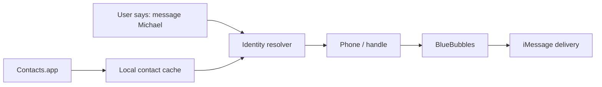

The trap starts with a name.

You want to tell the assistant, “message Michael,” and you want the system to know what that means. BlueBubbles is right there. It can send the iMessage. It has chats. It has handles. It has enough surface area to look like the place where identity should live.

That is the wrong job for it.

BlueBubbles is the pipe. The address book is the map. When those blur, the first version works just long enough to become annoying.

## The false shortcut

Messaging systems are tempting sources of truth because they are close to the action. If a message arrives from a phone number, the messaging layer can see the number. If a chat has a display name, the messaging layer may expose something name-like. If a delivery succeeds, it feels like the system must have understood the person.

It did not.

It only knew where to send bytes.

That distinction matters once an agent starts making decisions across channels. The assistant may need to answer by email, send a quick text, remember that two handles belong to the same person, or decide whether an inbound message came from someone trusted. A transport layer can help deliver the reply. It should not be asked to define the relationship.

When it is, the failures get weird:

- one person exists as a phone number in Messages and an email in Gmail
- a nickname in one app does not match the contact card
- a group chat hides the person you actually mean
- old handles linger after the contact has changed
- a cache starts growing little identity exceptions nobody owns

None of those bugs look dramatic. They look like “why did it choose that address?” or “why did it not recognize them?” That is worse, because the system still appears to work.

## Transport is not identity

The cleaner model is boring:

- Contacts.app owns identity.
- BlueBubbles owns iMessage transport.
- A resolver maps one to the other at the edge.



The important part is not the diagram. It is the boundary.

BlueBubbles should receive a resolved handle and send a message. It should not decide which Michael you meant, whether Michael is allowed to trigger an automation, or whether Michael’s email and phone belong to the same identity. That work belongs upstream.

This is also easier to debug. If delivery fails, inspect the transport. If resolution fails, inspect the cache or the contact card. If policy fails, inspect the rule. You are not spelunking through one blob that half-remembers people.

## The cache has one job

A local cache is useful, but only if it stays humble.

The cache should be a snapshot of the source of truth, not a second address book. It buys speed, normalization, and inspectability. It should not quietly become the place where you “just add one missing number” because that number was convenient for one send.

A good cache answers small questions:

- What emails do I have for this contact?
- What phone numbers do I have?
- When was this data generated?
- Which source produced it?

A bad cache starts answering social questions:

- Who is this person really?
- Which channel should always be preferred?
- Is this person trusted?
- Should this duplicate be merged forever?

Those questions need policy and provenance. They should be visible.

## What BlueBubbles is good at

None of this is a knock on BlueBubbles. It is useful because it stays close to messaging:

- send the message
- receive the webhook
- preserve chat/thread context
- expose handles
- bridge Apple messaging into an automatable surface

That is plenty.

The mistake is asking a good pipe to become a CRM. The pipe will try. It will even seem convincing in a small setup. Then the assistant grows another channel, and the lie shows up.

Email wants addresses. Messaging wants handles. Reminders want time. Memory wants continuity. Identity has to sit underneath those things, not inside one of them.

## The practical rule

Resolve before you send.

The call site should look conceptually like this:

```text
person -> contact resolver -> channel handle -> BlueBubbles send
```

Not this:

```text
person -> BlueBubbles lookup -> hope the handle is identity
```

The second shape is faster on day one. The first shape is still understandable on day thirty.

That is the tradeoff. You pay a little ceremony up front: a Contacts source, a cache refresh, a resolver, maybe a policy layer later. In exchange, the messaging server does not become a junk drawer for every identity shortcut you took while trying to get one message out.

That is the system I want: boring boundaries, visible resolution, and a transport layer that only has to be excellent at transport.
