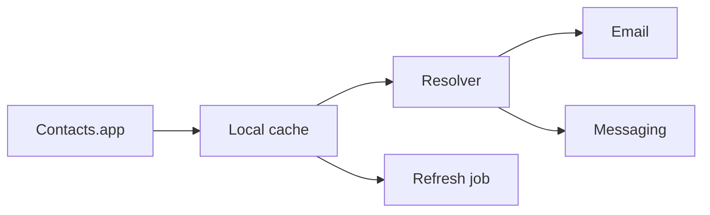

I keep coming back to one boring answer: Contacts.app.

Not BlueBubbles. Not Gmail. Contacts.

## Why the obvious answer is wrong

Messaging apps feel close to the problem, so it’s easy to let them become the source of truth. But they’re channels, not identity systems.

That creates drift:
- phone numbers stuck in one app
- email addresses missing in another
- duplicates everywhere
- updates that never quite converge

## The durable shape

Contacts.app already has the boring stuff handled:
- names
- emails
- phone numbers
- macOS permissions
- sync

So the pattern is simple:
1. read from Contacts.app
2. cache locally
3. resolve by name/email/phone
4. refresh on a schedule

## Why cache at all?

Because the live source is not the product.
The cache is.

It gives you speed, normalization, and a place to inspect data before using it.

## What this buys you

- outbound email becomes deterministic
- direct messaging can map names to handles
- inbound routing gets a clean identity layer later
- fewer weird mismatches between apps

The rule is simple: let the thing that owns the relationship stay in charge.
