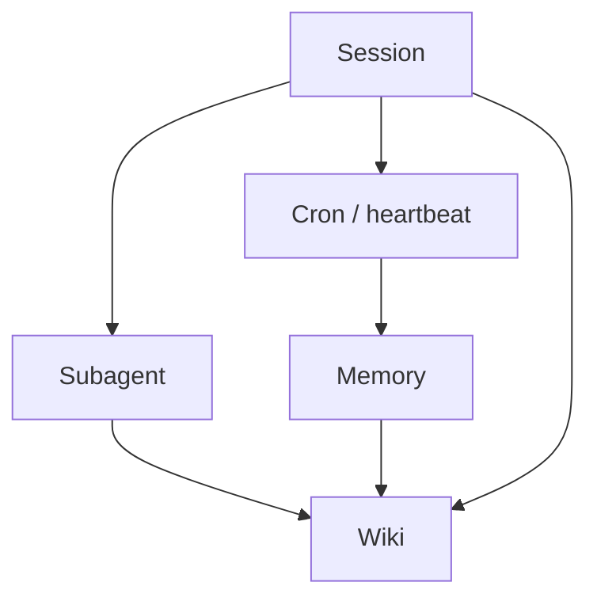

OpenClaw works best when the tools stay small and honest.

## The split

- **Subagents**: short, disposable tasks
- **Cron / heartbeats**: repeatable checks
- **Memory**: raw continuity
- **Wiki**: durable synthesis
- **Current session**: fast decisions

That keeps the system from turning into one giant blob pretending to be a brain.

## Why it matters

If everything happens inline, the session gets heavy.
If everything becomes memory, nothing is grounded.
If everything becomes wiki, the system stops being nimble.

The sweet spot is selective use:
- delegate what can be isolated
- cache what must be stable
- synthesize only what is worth keeping

## Rule of thumb

Use the smallest tool that can safely finish the job.

That sounds modest. It’s also usually enough.
