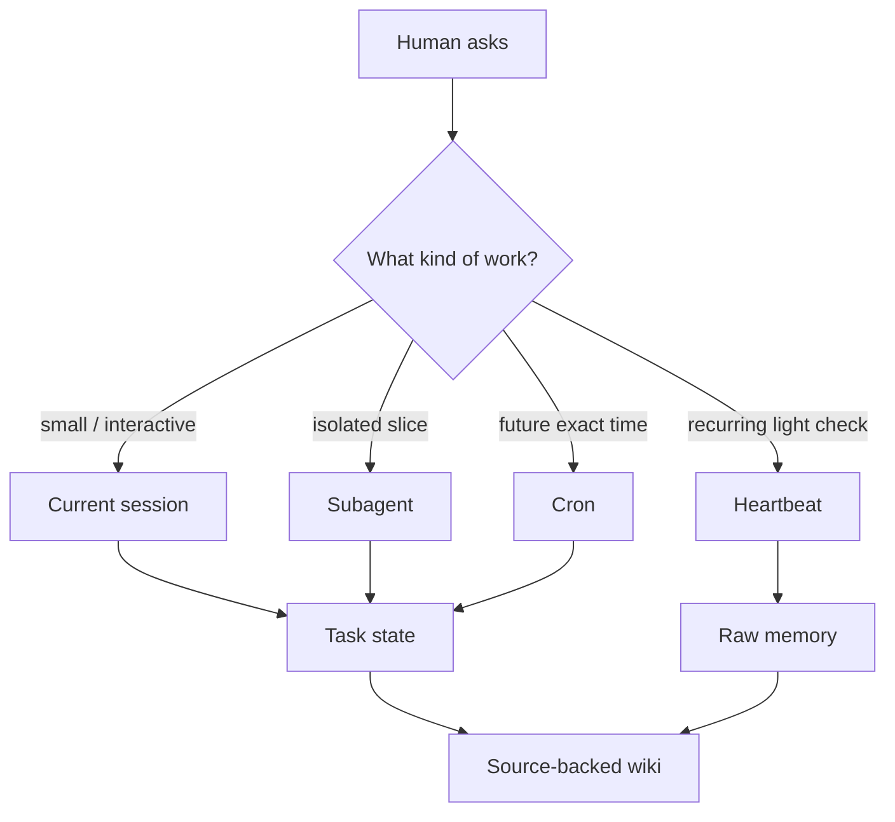

An agent system gets worse when every job happens in the same place.

The main chat is seductive. It has context. It has the human. It feels alive. So the lazy architecture is to keep adding work to the current session until it becomes a kitchen drawer: reminders, long-running tasks, research, synthesis, decisions, drafts, cron-like checks, half-finished plans.

Then the model starts confusing intention with state.

It says a job is running because the conversation planned it. It says something is remembered because it was mentioned once. It says a task is blocked because the sentence reached a blocker-shaped ending. The problem is not just verbosity. It is bad orchestration.

OpenClaw gives the work more than one surface. The trick is to use the smallest one that can still tell the truth.

## The surfaces have different jobs

Here is the division I keep coming back to:

| Surface | Best for | Failure if overused |
| --- | --- | --- |
| Current session | fast judgment, user-facing decisions, small edits | gets heavy and starts pretending plans are state |
| Subagent | isolated research, review, one-shot drafting slice | loses coherence if asked to own the whole project |
| Cron | exact future wakeups, recurring bounded checks | becomes zombie work without an exit contract |
| Heartbeat | batched lightweight proactive checks | turns into spam if it reports non-events |
| Memory | raw continuity and durable notes | becomes junk if every thought is promoted |
| Wiki | synthesized knowledge worth keeping | becomes stale doctrine if not source-backed |
| Task file | current owner state and resume point | becomes fiction if not updated after real progress |

The point is not to worship the table. The point is to stop asking one surface to do every kind of work.

## Context is not ownership

The current session is good at making decisions because it can talk to the human. That does not make it good at owning every background task.

If a task can be isolated, send it to a subagent. If it needs to happen later, schedule it. If it needs to survive restarts, write state. If it becomes durable project knowledge, synthesize it into the wiki with sources. If it is just a raw event, put it in memory and move on.

This is less mystical than “agentic orchestration.” It is mostly bookkeeping.

But bookkeeping is where truth enters the system.

## The proof boundary

Every orchestration choice should answer one question: what evidence will exist after the model stops talking?

For a subagent, the evidence is a completed child session and its result. For cron, it is a job id, schedule, run history, and exit condition. For memory, it is a file line. For wiki, it is a source-backed page. For the main session, it is the visible answer plus whatever artifact changed.

Without that evidence, progress becomes vibes.

That is why long-running background work needs an exit contract. A recurring proof-gate job, for example, should not run forever because “checking is good.” It needs acceptance criteria, a budget, and a self-disable condition. Otherwise it becomes one more process the assistant can vaguely gesture toward.

## The tradeoff

This architecture is less convenient in the moment.

It is faster to say, “I’ll keep an eye on it.” It is slower to create a bounded cron, write a task state, and record what would make the job stop. It is faster to ask one large model call to review six posts. It is safer to split the review into slices with explicit gates.

The slower version pays for itself when something goes wrong.

If the child task fails, the main session can see that it failed. If the cron is disabled, the job list says so. If memory has only raw notes, nobody mistakes it for a polished source of truth. If the wiki page cites its source, a later assistant can check whether it is stale.

Small surfaces make lies smaller.

## A useful rule

Use the least persistent thing that can safely finish the job.

If the work is quick and conversational, keep it in the session. If it is independent, isolate it. If it is timed, schedule it. If it must survive, write state. If it should teach future sessions, synthesize it with sources.

Do not turn every task into memory. Do not turn every memory into doctrine. Do not turn every plan into a background process. Do not keep a process alive just because stopping it would require a decision.

OpenClaw feels powerful when the pieces stay honest.

The agent can be magical at the edge. Underneath, it should be almost boringly clear where the work lives.
