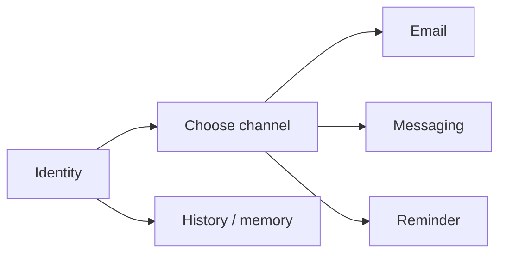

Personal assistants get messy when every system tries to be the source of truth.

The better model is plumbing.

## The parts

- **Contacts** tell you who someone is
- **Email** handles slower communication
- **Messaging** handles quick replies
- **Reminders** handle timing
- **Memory** handles continuity

Each piece should fail without taking the others down.

## The connection pattern

1. resolve identity
2. choose the channel
3. send the message
4. record what mattered
5. revisit only if needed

That feels almost too simple, which is usually a good sign.

## Why write it down

Because the goal isn’t one clever interface.
It’s communication that stays easy, durable, and unsurprising.

Less friction. Fewer misses. More continuity.
