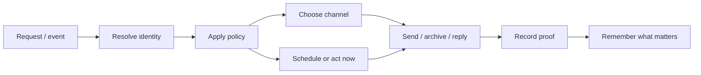

A personal agent does not become useful because it has one giant brain.

It becomes useful when the boring pipes connect.

That is less romantic, but it is the shape that survives contact with real life. Email, messaging, contacts, reminders, memory, calendars, files, and preferences all have their own ideas about the world. If the assistant treats any one of them as the whole truth, it gets brittle fast.

The job is not to collapse everything into one magical interface. The job is to keep the seams clean enough that the interface can feel simple.

## The layers

A useful personal assistant needs a few boring layers:

- **Identity**: who is this person?
- **Channel**: how should I reach them?
- **Policy**: am I allowed to act, reply, archive, or wait?
- **Timing**: should this happen now or later?
- **Memory**: what should survive this interaction?
- **Proof**: what evidence exists that the thing happened?

Those are different jobs. They can inform each other, but they should not silently merge.

If email becomes identity, phone-first relationships vanish. If messaging becomes policy, every handle starts looking trusted. If memory becomes proof, the assistant starts confusing notes with completed work. If timing lives only in the chat, reminders disappear when the session resets.

The system gets safer when each pipe keeps its own job.

## The flow

The simple version looks like this:

That diagram is not an implementation. It is a restraint.

It says the assistant should resolve identity before choosing a channel. It should apply policy before acting. It should record proof before claiming success. It should remember the durable lesson, not every incidental detail.

## A concrete example

Take inbound email.

The naive version is: read the inbox, ask the model what to do, do it.

That will work exactly long enough to scare you.

The plumbing version is slower and better:

1. refresh Contacts.app into a local cache
2. build an allowlist from known contact emails
3. separate known-contact mail from everything else
4. apply the reply/archive policy
5. take the Gmail action
6. record enough state to avoid repeating yourself

Now the assistant is not just “smart about email.” It has a path.

Contacts owns identity. Gmail owns mail operations. The policy says what to do with known contacts. State prevents duplicate replies. Logs or command output become proof. Memory only keeps the rule or outcome worth carrying forward.

That is plumbing.

## Why this matters for trust

Personal agents operate close to embarrassment.

A wrong shell command is annoying. A wrong reply to a person is different. It can create social confusion. It can leak context. It can make the human feel like the machine is improvising with their relationships.

Clean plumbing reduces that risk. It gives the assistant fewer places to invent.

When it needs to message someone, it resolves the person from the address book. When it needs to wait, it creates a scheduled job instead of promising to remember. When it needs to claim something is done, it points at the artifact, run id, diff, or command output. When it learns a preference, it writes it where future sessions can find it.

None of that removes judgment. It gives judgment rails.

## The tradeoff

The tradeoff is that good personal infrastructure feels disappointingly incremental.

You do not get the grand unified assistant in one move. You get a contact resolver. Then a Gmail proof. Then a messaging send. Then a reminder path. Then a memory rule. Then a policy that says when not to speak.

Each piece is small enough to test. Each piece is also small enough to replace.

That modularity is the point. A personal agent should not require faith in a blob. It should earn trust by making the next action inspectable.

## The principle

Let each system do the boring thing it is already good at.

Contacts should know people. Gmail should handle mail. BlueBubbles should handle iMessage. Cron should handle time. Memory should handle continuity. The assistant should coordinate, decide, and explain.

If that sounds unglamorous, good.

The magic should be in how little the human has to think about it. The plumbing underneath should be plain enough that when something leaks, you know which pipe to fix.
