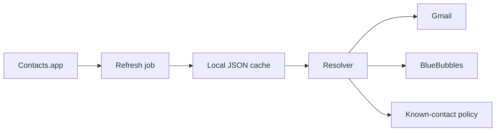

---

## layout: post
title: "The Best Identity Layer Is the One You Already Maintain"
date: 2026-04-29
description: "For a personal agent, Contacts.app is boring in exactly the right way."
tags: [contacts, macos, automation]

I tried to make the agent smarter. The answer was already sitting in Contacts.app.

That feels too mundane to be an architecture decision, which is why it is easy to miss. Builders like fresh databases. Agents make that temptation worse. The moment you connect email, iMessage, reminders, and memory, you want a crisp identity service with perfect records and clever matching.

For a personal assistant running on a Mac, the better first move is simpler: use the system address book.

Not because Contacts.app is glamorous. Because it is already where the human work happens.

## The wrong source of truth is usually nearby

Every channel has just enough identity to cause trouble.

Gmail has email addresses and display names. BlueBubbles has handles and chats. Calendar has attendees. A memory file might mention someone by first name. Each one feels close to a useful answer.

None of them should own the person.

If Gmail becomes the source of truth, phone-first contacts disappear. If messaging becomes the source of truth, email-only contacts disappear. If memory becomes the source of truth, the assistant starts preserving guesses as facts. If every integration keeps its own little map, the system works until two maps disagree.

Then the assistant hesitates in exactly the wrong place: at the boundary between intention and action.

“Reply to Michael” should not start a scavenger hunt.

## What Contacts.app gives you

Contacts.app is not perfect. It is just boring in the right ways.

It already stores:

- names
- email addresses
- phone numbers
- local macOS permissions
- iCloud sync, if the human uses it
- the messy edits people actually make over time

More importantly, it has a human owner. If a card is wrong, the fix is legible: update the contact. The assistant does not need to invent a parallel place where the “real” Michael lives.

That matters for trust. Personal agents do not just need data. They need data the human can understand, correct, and revoke.

## The useful shape

The shape I want is not “query Contacts.app live every time.” That would make every send depend on app state, permissions, AppleScript quirks, and timing.

The durable shape is:




Contacts.app remains the source. The local cache becomes the working copy. The resolver turns a name, email, or phone number into the handle a channel needs.

That division gives the agent three useful properties:

1. **Speed**: most lookups hit a local file.
2. **Inspectability**: the cache can be opened, diffed, and tested.
3. **Recovery**: if refresh breaks, the last known snapshot can still explain what happened.

The cache is not there to be clever. It is there to make a slow, permissioned, GUI-adjacent source usable from automation.

## The small proof that matters

A contact resolver does not have to start fancy. The local script in this setup does two things:

```bash
scripts/contacts.sh refresh
scripts/contacts.sh resolve "Michael Chan"
```

The first command snapshots Contacts.app into local state. The second searches names, emails, and phones. That is enough to prove the boundary.

The point is not that this script is the final identity platform. The point is that identity now has a home. Gmail can ask for an email. BlueBubbles can ask for a phone or handle. Inbound mail can ask whether the sender is already a contact. Those are different questions, but they all pass through the same source.

## What this does not solve

This does not magically solve identity.

It does not merge duplicates for you. It does not decide whether two people with the same first name are the same person. It does not know whether a work email should beat a personal phone number. It does not replace judgment with a lookup table.

Good. Those are policy questions. They should stay visible.

The tradeoff is that you now have a refresh step and a cache to maintain. That is real machinery. It can fail. It needs tests. It needs a dry-run mode before destructive actions use it.

But that machinery is easier to reason about than six integrations each deciding who someone is.

## The rule I want to keep

Let the human-maintained system own identity.

Everything else can borrow from it.

That sentence sounds small, but it prevents a lot of future weirdness. It keeps the assistant from turning channel metadata into biography. It gives the human one place to correct the record. It makes later policy work possible because the inputs are not already scattered.

Contacts.app is not exciting. That is the feature.