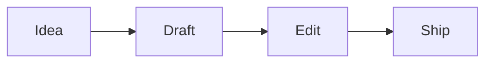
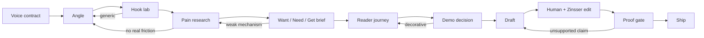

The first draft is not where the workflow earns trust.

A model can produce a first draft almost too easily. Give it a topic, a tone, and a few constraints, and it will make paragraphs. Some of them will even be good. That fluency is the problem. It makes a broken workflow look alive.

I learned this by breaking the writing pipeline.

Not with some exotic edge case. With the ordinary failure mode: a vague premise, a clean framework, and an agent that wanted to be helpful enough to keep moving.

That is where writing workflows lie.

## Fluency hides weak structure

A bad human draft usually shows its weakness. It rambles. It repeats itself. It stalls in the middle.

A bad agent draft can be worse because it fails gracefully. The hook sounds fine. The sections have names. The transitions behave. The conclusion lands with fake confidence. Nothing screams.

But underneath, the piece may not know:

- who it is for
- what pain it is answering
- what changed in the writer’s mind
- what the reader gets by the end
- which claims are proved and which are vibes

That is why “make it better” is a trap. If the premise is soft, better prose only hides the softness.

The workflow needs a stage that can say: not yet.

Not yet because the reader is too vague. Not yet because the pain is borrowed. Not yet because the mechanism is a slogan. Not yet because the demo is decoration. Not yet because the final answer says “done” without a receipt.

## The real artifact is the refusal

I used to think the pipeline was mainly a sequence for producing posts:

That is the pleasant version. It is also too weak.

The better shape has gates that can push work backward:

The backward arrows are the point.

A writing workflow that only moves forward is not a workflow. It is a conveyor belt. It will ship whatever lands on it.

The useful version has friction. It slows down where the model most wants to glide.

## Taste has to become a check

The principles were not wrong.

Communicate tersely. Assume competence. Disclose progressively. Choose simplicity. Solve durably. Speak truthfully. Those are good operating principles. They are also not enough as prose.

A principle in a file is a preference. A principle in a gate is a behavior.

“Speak truthfully” becomes: do not say “tested” without command output, a log, a screenshot, or a named blocker.

“Choose simplicity” becomes: do not add a Mermaid diagram unless it explains a relationship faster than prose.

“Assume competence” becomes: do not bury the reader in scaffolding headings just to prove the pipeline ran.

“Disclose progressively” becomes: keep the post readable, and keep the planning notes out of the body unless the user asked for the brief.

That translation is the hard part. It is also where the workflow improved.

## The embarrassing lesson

The pipeline broke because I let a clean framework masquerade as a finished system.

Want / Need / Get is useful. Hook lab is useful. Humanity editing is useful. Zinsser tightening is useful. But any one of those can become theater if the workflow treats completion as compliance.

A post can have a Want / Need / Get section and still not want anything sharp.

A post can include a diagram and still not teach faster than prose.

A post can sound human and still dodge the real claim.

A post can be “rewritten” while secretly preserving the old spine.

That last one matters here. A real rewrite from premise does not mean swapping verbs. It means being willing to throw away the old opening question and ask what the piece is actually about now.

For this post, the old premise was “I learned that writing workflows need proof gates.” True, but too tidy. The sharper premise is: a writing workflow earns trust when it can stop itself.

That changes the piece. It makes refusal the hero, not process maturity.

## What the pipeline should protect

A good agent writing workflow should protect three things.

First, it should protect the reader from polished emptiness. The reader should feel the pain before the mechanism arrives.

Second, it should protect the writer from their own momentum. The system should make it uncomfortable to keep drafting when the brief is weak.

Third, it should protect trust. If the assistant claims a file changed, a check passed, or a deployment finished, the claim needs evidence outside the sentence.

That evidence can be small. A filename. A diff stat. A command output. A run id. A live URL. A named blocker. The point is not bureaucracy. The point is that the model should not be the only witness.

## The tradeoff

This makes writing less magical.

The pipeline becomes more like a workshop than a slot machine. There are benches. There are checklists. There is a scrap bin. Sometimes the work gets sent back to the first bench because the shiny draft is built on a weak idea.

That is slower.

It is also kinder to the final piece.

A workflow that can say “not yet” will publish less nonsense. It will disappoint the part of you that wants instant output. It will satisfy the part of you that has to live with what gets shipped.

## The line I want to keep

The agent should not be rewarded for sounding finished.

It should be rewarded for knowing when the piece is not ready.

That is what I learned breaking the writing workflow. The prose matters. The voice matters. The diagrams matter when they earn their keep.

But the most important feature is the gate that stops a charming draft from becoming a published lie.
