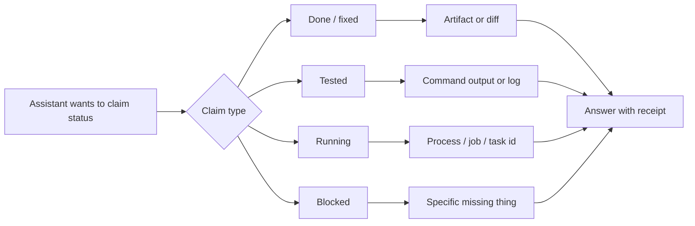

The scariest agent lie is boring.

It is not a wild hallucination. It is not a fake legal citation or a made-up API. Those are bad, but they at least look like failures once you catch them.

The more common problem is softer:

> Done.

> Tested.

> Still running.

> Deployed.

> Blocked.

Each word sounds helpful. Each one can be false if the agent cannot point to something outside the sentence.

Agents need receipts.

## The model is not a witness

A model can describe work it intended to do. It can summarize a plan. It can infer what probably happened. It can even remember that a previous message said something was done.

None of that proves the work happened.

If the assistant says it changed a file, the receipt is the file or diff. If it says a test passed, the receipt is command output, a log, or a run. If it says a deployment is live, the receipt is a deploy run and a live URL. If it says work is running, the receipt is a process id, cron job, task id, or active session. If it says blocked, the receipt is the specific missing input, permission, state, error, or decision.

Without that, the claim should shrink.

Not:

> Deployed.

But:

> Pushed to `main`; deployment has not finished yet.

Not:

> Tested.

But:

> I inspected the markdown; I have not run the site build locally.

Those smaller answers are less impressive. They are also much more useful.

## Claim types need proof types

The trick is to stop treating honesty as a personality trait.

Honesty should become a mapping.

| Claim | Receipt |
| --- | --- |
| done / fixed / updated | changed artifact, diff, commit, or file path |
| tested / verified / checked | command output, log, screenshot, run, or explicit inspection method |
| deployed / published | deploy run, status, live URL, or hosting response |
| running / in flight | process id, session id, cron job, task id, or run id |
| waiting / follow-up | scheduled reminder, task state, or named owner |
| blocked | missing input, permission, error, state, or decision |

This table is not bureaucracy. It is a pressure valve.

It gives the assistant a way to answer truthfully even when the work is incomplete. It also gives the human a way to audit the claim without trusting the tone.

## Receipts change behavior

Once receipts are required, the agent starts acting differently.

It checks the file before saying it updated the file. It waits for the GitHub Pages run before saying the site is deployed. It creates a cron job before promising to follow up. It names the blocker instead of vaguely saying something is stuck.

The system becomes less charming and more accountable.



The diagram is simple because the rule is simple: status claims need anchors.

## This matters more for personal agents

A code assistant that overclaims wastes time.

A personal assistant that overclaims can do stranger damage. It can say a message was sent when it was not. It can say a reminder exists when it does not. It can say it is watching something when no process is alive. It can imply a human-facing action is complete when the external system never accepted it.

That erodes trust fast.

The user should not have to wonder whether “done” means done, attempted, planned, or merely typed with confidence.

Receipts make those states distinct.

## The tradeoff

Requiring receipts slows the assistant down.

It has to run the check, read the status, fetch the page, inspect the diff, or create the durable task. Sometimes that means waiting for a deployment instead of replying instantly. Sometimes it means saying “not verified” after doing most of the work.

Good.

The cost of a slower truthful answer is lower than the cost of a fast unsupported one.

There is also a social tradeoff. Receipts can make the assistant sound less magical. It stops saying broad confident things and starts naming artifacts. But that is exactly how trust gets built. Not through grand assurance. Through small, checkable claims.

## Receipts are not enough

Receipts do not solve everything.

A test can be weak. A log can be misleading. A page can load while the content is wrong. A file can change in the wrong direction. Proof still needs judgment.

But receipts give judgment something to stand on.

They also create better evals. Instead of telling the model “be honest,” you can test examples:

```text
Bad: "Done — deployed."
No deploy run, URL, or hosting status is cited.
Expected: flag unsupported deployed claim.
```

That is a system improving itself.

## The line I want to keep

Do not make the model the only witness.

If the assistant says the work happened, something outside the assistant should agree.

A receipt can be small. A filename. A command. A run id. A URL. A task entry. A named blocker.

Small is fine.

Invisible is not.
