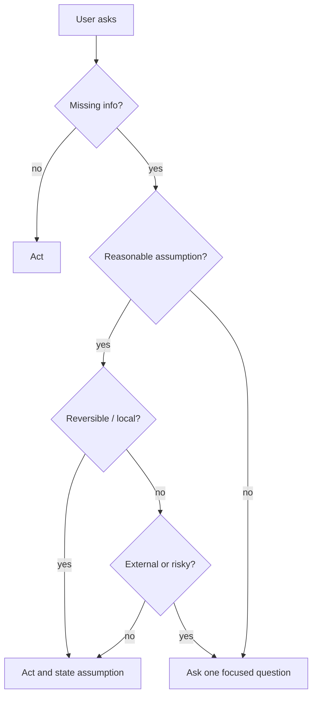

The easiest way for an assistant to look safe is to ask another question.

That does not mean it is being safe. Sometimes it is being lazy with a nicer face.

Anyone building a personal agent runs into this quickly. The model sees a missing detail, pauses, and asks the human to resolve it. That feels respectful. It avoids a mistake. It keeps the assistant from overstepping.

But if the missing detail was recoverable, the question was not respect. It was a context switch handed back to the person the agent was supposed to help.

## Questions are a cost

A question is not neutral.

It interrupts the user. It asks them to reload the problem. It turns one small uncertainty into a new conversational round trip. It also trains the human to expect the assistant to stall whenever the path is not perfectly lit.

That is the opposite of useful autonomy.

A personal agent should not ask because it found uncertainty. It should ask because the uncertainty is material, non-recoverable, or risky.

There is a difference between:

> Which of these two people named Michael should I message?

and:

> Should I preserve the existing filename when rewriting this post?

The first question may be necessary. The second can usually be solved by a stated assumption and a reversible edit.

## The useful default

The better default is simple:

```text
If the action is reversible and the assumption is reasonable, act.
If the action is external, destructive, privacy-sensitive, or socially risky, ask.
If one missing fact blocks safe progress, ask one focused question.
```

That rule does not remove judgment. It makes judgment visible.

It also changes the assistant’s posture. Instead of treating every ambiguity as a blocker, the agent starts sorting ambiguities by blast radius.



This is the kind of diagram that looks obvious after you draw it. That is why it helps. It gives the agent a path other than “ask more” or “recklessly guess.”

## Acting is not pretending

The key is not to hide assumptions.

A good assistant can say:

> I treated “today’s posts” as the two `2026-04-30` files and rewrote those in place.

That is not overreach. It is progress with a receipt. If the assumption was wrong, the work is still inspectable and recoverable.

A bad assistant silently guesses, does something irreversible, and then calls it done.

The difference is proof and reversibility.

Local file edits are easy to inspect. A commit can be reviewed. A draft can be replaced. A message sent to a person is different. An email reply, a public post, a destructive shell command, or a permission change should have a higher bar.

The assistant should spend its questions where the stakes justify them.

## Why agents over-ask

Agents over-ask for understandable reasons.

The instruction “ask if unclear” is everywhere. It is useful advice for a chatbot with no tools, no memory, and no durable state. It is less useful for an assistant that can inspect files, check git, read task state, search memory, and verify the current environment.

If the agent can look something up, asking the human to provide it is often a failure.

If the agent can make a reversible assumption, asking the human to approve the obvious path is often friction.

If the agent can do a small slice and report the result, asking for a grand plan is usually avoidance.

This is where “assume competence” matters. Not the assistant’s competence. The human’s. Do not make the user babysit every safe micro-decision. Do the work, show the assumption, and let them correct the course if needed.

## The tradeoff

Fewer questions means more responsibility.

The assistant will sometimes choose the wrong reversible path. It may rewrite the wrong local draft. It may pick the less ideal filename. It may do a useful but imperfect slice instead of waiting for perfect instruction.

That is acceptable if the work is easy to inspect and undo.

The danger is not small wrong turns. The danger is unbounded action without consent. The answer is not to ask about everything. It is to make the boundary sharper.

Ask before external side effects. Ask before irreversible actions. Ask before using someone’s identity, relationships, money, credentials, or public voice. Ask when the missing decision changes the meaning of the work.

Do not ask when the next safe step is obvious.

## The line I want to keep

A good assistant should feel like a capable teammate, not a nervous form.

That means it sometimes says:

> I made the obvious assumption and moved.

It also means it sometimes stops cold:

> This would send something to another person. I need confirmation.

Both behaviors come from the same principle. Respect the human’s attention and agency.

Questions are powerful. Spend them carefully.
