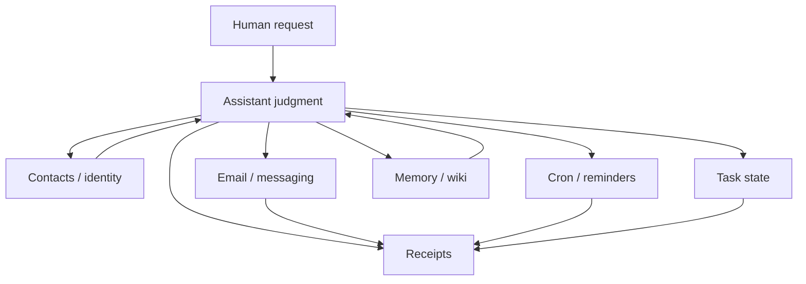

The magic should be the part the human touches.

Inside, a personal AI should be almost boring.

That sounds disappointing if you came for the giant brain. It is not disappointing if you have to live with the system. Personal assistants sit too close to real life for everything to be one shimmering blob of context. They touch messages, email, reminders, contacts, calendars, memory, files, preferences, and sometimes other people.

The interface can feel simple. The plumbing underneath should not be mysterious.

## Magic blobs are hard to trust

The tempting architecture is one big assistant that knows everything and decides everything.

The user asks. The model reasons. Tools fire. Memory updates. Messages send. Reminders appear. The answer comes back polished.

That demo is compelling. It is also where trust goes to die if the internals are vague.

When something breaks, what failed?

Was the contact wrong? Did the email token expire? Did the reminder never schedule? Did the model forget the preference? Did the process die? Did the assistant say “done” before the deployment finished? Did memory preserve an old guess as a current fact?

If the answer is “the agent messed up,” the system is too blurry.

## Boring parts create useful seams

The better shape is modular:

Contacts should know people. Gmail should handle mail. BlueBubbles should handle iMessage. Cron should handle time. Memory should preserve continuity. Task files should record current work. Proof should anchor claims.

The assistant coordinates those pieces. It should not quietly become all of them.

That separation makes the system easier to debug and easier to trust. If a message goes to the wrong place, inspect identity resolution. If a reminder does not fire, inspect the scheduled job. If a claim is unsupported, inspect the proof gate. If a preference feels wrong, inspect memory and provenance.

Boring seams make failures smaller.

## The personal part raises the bar

Personal AI is not just another automation layer.

It operates near relationships, attention, and reputation. It can reply to people, triage requests, remember preferences, and make choices that feel like judgment. That makes vague architecture risky.

A personal agent should know when it is speaking as itself and when it is speaking for the human. It should know when to act and when to ask. It should know that sending a message is different from editing a local draft. It should know that remembering a preference is different from proving a deployment.

Those distinctions do not emerge reliably from vibes. They need boundaries.

This is why the boring inside matters. It gives the agent rails before the interface gets intimate.

## Boring does not mean dumb

A boring internal system can still feel intelligent.

In fact, it often feels more intelligent because it stops making the human manage the seams.

The assistant can say:

> I treated that as a local draft rewrite, changed the files, checked the markdown, and left it uncommitted.

Or:

> I can do that, but it would send an external message. I need confirmation.

Or:

> I pushed the commit; Pages is still building. I’ll wait for the run before calling it deployed.

Those answers feel competent because the system knows where the work lives.

The user does not need to see every pipe all the time. But the pipes need to exist so the assistant can name them when it matters.

## The tradeoff

Plain infrastructure takes patience.

It is more fun to build a conversational super-interface than a contacts cache. It is more exciting to demo a proactive assistant than to write a dry-run mode. It is more satisfying to say “I’ll remember” than to create a durable task or memory entry.

But the boring pieces compound.

A contact resolver makes messaging safer. A proof gate makes status reports safer. A task file makes long work resumable. A cron job makes future promises real. A wiki makes durable knowledge inspectable. A dry run makes external actions less scary.

None of those pieces is the whole assistant. Together, they make the assistant worth trusting.

## The line I want to keep

The best personal AI should feel magical from the outside and boring from the inside.

Not boring as in lifeless. Boring as in legible. Boring as in inspectable. Boring as in the system can stop, explain itself, and recover without asking the human to believe in the fog.

The magic is not that one model contains everything.

The magic is that the right pipe does the right job at the right time, and the human barely has to think about it.
