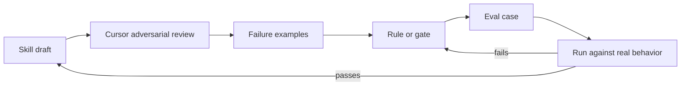

**Cursor is most useful when it stops being polite.**

Not rude. Not theatrical. Just mean in the way a good pair programmer can be mean.

The kind who reads your agent skill and says:

> This sounds nice. What happens when it times out?

That is the question most skill files need.

## Want / need / get

- **Want:** use Cursor to make agent skills stronger, not just longer
- **Need:** adversarial review that finds ambiguity, unsupported claims, and broken handoffs
- **Get:** a loop where Cursor attacks the skill, you turn failures into gates, and the agent gets harder to fool

The trap is using Cursor as a prose polisher.

That feels productive because the skill gets cleaner. The headings improve. The rules sound sharper. The file looks more intentional.

But agent skills do not fail because a bullet was ugly.

They fail because the instruction leaves a gap big enough for the model to drive through.

## Agent skills are not normal docs

A skill file looks like documentation.

It is not just documentation.

It tells an agent when to act, what to read, what to produce, what to refuse, how to recover, and what counts as done. That makes it closer to a tiny operating procedure than a README.

So the review should be meaner than a docs review.

A normal docs pass asks:

- Is this clear?
- Is this organized?
- Is this readable?

A useful agent-skill pass asks:

- What can the agent falsely claim?
- What can it skip while sounding compliant?
- What happens if a subagent dies?
- What state survives a restart?
- What external action needs permission?
- What does “done” mean?
- What proof is required?

Those are better questions.

They are also exactly the kind of questions Cursor can help keep in view while you edit the surrounding files.

## The prompt I want from Cursor

Not this:

```text
Please improve this skill file.
```

That invites polish.

Use something meaner:

```text
Review this agent skill as an adversarial pair programmer.

Find places where the agent can:
- claim work is done without proof
- skip a required stage
- keep running after its exit condition
- ask the user instead of using available tools
- mutate higher-level principles
- perform external side effects without permission
- fail to resume after timeout or restart

For each issue, give:
1. the ambiguous instruction
2. the likely bad behavior
3. the smallest concrete rule, gate, or eval case that would catch it
```

That prompt changes the work.

Now Cursor is not decorating the skill. It is attacking the seam between intention and behavior.

## The loop

The useful loop is small.



The important step is the eval case.

Without it, you just have a better-sounding instruction. With it, you have a tripwire.

For a writing skill, that might mean examples where the assistant says “done” without naming the file it changed. Or says “I tested it” without command output. Or claims a background process is running without a process id, cron job, or task entry.

For an inbox skill, it might mean examples where the agent replies externally before permission is established.

For a research skill, it might mean examples where the agent invents citations or confuses a source summary with proof.

Cursor can help write all of those cases. More importantly, it can help notice when the skill has no place for those cases to attach.

## Mean does not mean bloated

The danger is turning every skill into a contract full of legalese.

That is the wrong direction.

A mean review should usually make the skill shorter.

It should replace soft instructions with hard edges:

```text
Weak: Be careful when reporting progress.
Stronger: Do not say work is running unless you can cite a live process, cron job, task id, or session.
```

```text
Weak: Use good judgment before drafting.
Stronger: If Want, Need, or Get is vague, stop and name the missing concrete pain.
```

```text
Weak: Recover gracefully from failure.
Stronger: After timeout, update the task file with last completed stage, blocker, and next action.
```

Good hardening is not more words.
It is fewer escape hatches.

## Where Cursor helps most

Cursor is especially useful when the skill spans files.

A writing workflow might have a parent skill, child skills, reference checklists, eval fixtures, task state, and published drafts. Looking at one file at a time misses the real failure modes.

The bug is often in the handoff:

- the parent says to package first, but the draft skill accepts vague briefs
- the edit skill preserves voice, but the output contract rewards generic polish
- the resilient-work skill says to resume, but no task state records the stage
- the proof gate checks final answers, but not tool-narration claims

A mean pair programmer follows those seams.

It asks whether the system can actually do what the instruction says.

## The tradeoff

This style makes Cursor less fun.

You get fewer “nice refactor” moments and more uncomfortable questions. You also spend more time writing fixtures, gates, and boring acceptance criteria.

But that is where the value is.

If a skill only works when the agent is already behaving well, it is not hardened. It is flattered.

## The lesson

Do not ask Cursor to make your agent skill sound smart.

Ask it to make the skill fail.

Then keep the failures.
Turn them into gates.
Turn the gates into evals.
Turn the evals into the part of the workflow that refuses to be charmed.

That is the mean pair programmer you want.
