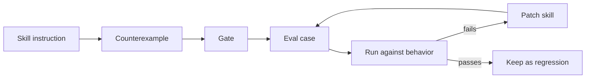

---

## layout: post

title: "Cursor Should Write the Counterexample"
date: 2026-04-30
description: "The best use of Cursor for agent skills is not polish. It is turning vague instructions into failures the workflow can catch."
tags: [cursor, agents, skills, evals]

Do not ask Cursor to improve the skill.

That prompt is too polite. It invites the wrong kind of help: cleaner headings, smoother bullets, more complete-sounding rules. The file gets nicer. The agent may not get safer.

Ask Cursor to write the counterexample instead.

That is the job I want from a mean pair programmer. Not cruelty. Not clever dunking. Just the discipline of looking at an instruction and asking: how will the model satisfy the words while violating the intent?

## Agent skills fail in the gap

An agent skill looks like documentation, but it behaves more like an operating procedure. It tells the agent when to use tools, when to ask, when to stop, what to produce, what to verify, and what state must survive a restart.

That means the dangerous lines are rarely the ugly ones.

The dangerous lines are the soft ones:

- “Use good judgment.”
- “Make progress.”
- “Verify the result.”
- “Handle failures gracefully.”
- “Run the full pipeline.”
- “Do not be lazy.”

Those lines can be true and still useless.

A model can comply with them in tone while skipping the behavior. It can “verify” by rereading its own output. It can “make progress” by writing a plan. It can “handle failure” by apologizing. It can “run the full pipeline” by leaving the scaffold visible in the published post.

The instruction sounded right. The counterexample reveals that it was not operational yet.

## The better prompt

I do not want Cursor to be a copyeditor first. I want it to be an adversary with a repair habit.

A useful prompt looks like this:

```text
Review this agent skill by writing counterexamples.

For each major instruction, show how an agent could appear compliant while failing the user's intent.

Return:
1. the instruction being exploited
2. the bad-but-plausible behavior
3. the missing gate
4. the smallest eval case or fixture that would catch it
5. the shortest rule change that would prevent it
```

That changes the output.

Now Cursor is not saying “this section could be clearer.” It is saying “the agent can say it ran the pipeline while only editing the draft body, because nothing forces premise regeneration or stage evidence.”

That is the kind of critique that improves a skill.

## From prose to tripwire

The loop should be small:




The counterexample is the hinge.

Without it, a rule stays abstract. With it, you can turn taste into a tripwire.

For example:


| Soft rule                        | Counterexample                                              | Gate                                                                               |
| -------------------------------- | ----------------------------------------------------------- | ---------------------------------------------------------------------------------- |
| “Report progress honestly.”      | Agent says “still running” after the process died.          | Running claims require process id, cron job, task id, or live session.             |
| “Use the full writing pipeline.” | Agent preserves the old premise and only smooths sentences. | Rewrite must change angle/hook/journey or explicitly justify preserving them.      |
| “Verify correctness.”            | Agent says “tested” after visual inspection only.           | Tested claims require command output, log, artifact, screenshot, or named blocker. |
| “Recover after timeout.”         | Agent restarts from scratch and loses prior work.           | Task file must record last completed stage, blocker, and next action.              |


This is the work Cursor is good at because it can sit next to the editor and keep asking the annoying question: what would failure look like here?

## Mean review should make the skill shorter

There is a bad version of hardening where every skill turns into a legal contract.

That is not the goal.

A good counterexample pass often cuts words. It replaces soft advice with a hard edge:

```text
Weak:
Be careful not to overstate completion.

Stronger:
Do not say done, fixed, tested, deployed, running, or blocked unless the answer names the artifact, check, process, URL, job, or missing input that proves it.
```

Or:

```text
Weak:
Run the whole writing workflow.

Stronger:
Before drafting, produce or internally satisfy voice, angle, hook, pain, brief, journey, and demo gates. If a gate fails, stop there instead of drafting around it.
```

That is not more ornate. It is more executable.

The aim is fewer places for the model to hide.

## Where Cursor sees what the model misses

Cursor is especially useful across files.

Agent behavior rarely comes from one skill file. It comes from the parent skill, child skills, reference docs, eval fixtures, task state, memory, and the actual artifacts produced last time.

The bug often lives in a handoff:

- the parent skill requires a strong brief, but the draft skill does not reject weak briefs
- the demo guide says “do not decorate,” but the post template rewards diagrams
- the proof gate checks final answers, but tool narration can still overclaim
- the task file says to resume, but no stage gets recorded after failure
- the user asks for premise-level rewriting, but the workflow has no evidence that the premise changed

A mean pair programmer follows the seam instead of admiring the local prose.

It asks: where can this system still lie?

## The tradeoff

This makes Cursor less flattering.

You get fewer instant improvements and more small accusations. You spend more time writing fixtures. You keep ugly examples around. You preserve cases where the agent behaved badly instead of rushing to forget them.

That can feel tedious.

It is also the difference between a style guide and a system.

A style guide says what good behavior sounds like. A system catches bad behavior when it sounds good.

## The line I want to keep

Cursor should not be the friend who makes the instruction prettier.

It should be the pair programmer who writes the failing test.

If the skill says “full pipeline,” Cursor should ask what lazy compliance looks like. If the skill says “verify,” Cursor should ask what proof the model can cite. If the skill says “resume,” Cursor should kill the process in its head and ask what survives.

That is mean in the useful sense.

It gives the agent fewer flattering exits. It turns vague taste into concrete gates. It makes the next failure smaller, earlier, and easier to fix.

Do not ask Cursor to polish the skill first.

Ask it to write the counterexample you will be embarrassed to ship without.