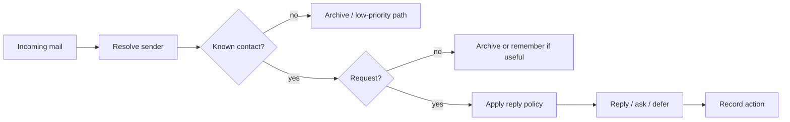

An inbox is a terrible place to think.

It is a good place for messages to arrive. That is different.

Most email workflows quietly treat the inbox as a todo list. Messages come in, sit there, and accumulate moral weight. Unread means maybe important. Read means maybe handled. Archive means maybe done. None of those states are precise enough for an assistant.

If every email is a request, the inbox should not be the work system.

It should be the router.

## Email needs classification before action

A personal agent reading email has to answer a few questions before it does anything useful:

- Who sent this?
- Is the sender known?
- Is there an actual request?
- Can the assistant answer it?
- Should it reply, archive, remind, escalate, or ignore?
- What proof should exist afterward?

Those questions are not inbox states. They are routing decisions.

The naive workflow is:

```text
read inbox -> ask model -> reply/archive
```

That is too much trust in one step. It lets a language model turn raw mail into external action without enough rails.

The better workflow is more boring:



That is the difference between an inbox assistant and an inbox router.

## The contact layer matters

The first useful split is identity.

Mail from a known contact deserves a different path from promotional noise, automated updates, or unknown senders. That does not mean unknown mail is worthless. It means known-contact mail has social context the assistant should respect.

This is why the contact source matters. Gmail’s display name is not enough. A random sender can look familiar. A mailing list can impersonate importance. The assistant needs a source of truth outside the message itself.

For a personal setup, Contacts.app is a reasonable first source. Refresh it into a local cache. Build an allowlist from the email addresses. Use that to route, not to hallucinate intimacy.

Now the inbox is not a pile. It is a stream with lanes.

## “Every email is a request” changes the design

The rule “treat every email as a request” sounds simple. It is not.

It means the assistant should not merely summarize mail. It should decide what the sender is asking for, whether enough information exists, and what response is appropriate.

Sometimes the best reply is an answer.

Sometimes it is a clarification.

Sometimes it is no reply plus archive.

Sometimes it is a reminder because the request cannot be handled now.

Sometimes the safest move is to stop and ask the human because the reply would speak for them in a way the assistant should not improvise.

A todo-list inbox hides those distinctions. A router forces them into the open.

## State prevents awkwardness

Email mistakes are socially expensive.

A script that replies twice is not just a bug. It is awkward. A script that archives the wrong message can make the human miss something. A script that asks for clarification after the user already provided the body looks careless.

So the router needs state.

At minimum, it should know which messages it handled, which replies it sent, and which threads are waiting. That state does not need to be grand. A small JSON file can be enough for a first version. The point is that memory of action should live outside the model.

The assistant should be able to answer:

- I replied to this message id.
- I archived this query.
- I skipped this because the sender was unknown.
- I asked for a missing body.
- I am waiting on a human decision.

Without that, “handled” is just a mood.

## The tradeoff

Routing is less glamorous than a smart inbox.

It requires contact refreshes, Gmail queries, allowlists, state files, dry runs, and proof. It also makes the assistant slower to improvise. It cannot just read a message and perform confidence.

Good.

Email is an external surface. Replies leave the machine. Archives change what the human sees. The system should be a little conservative there.

The goal is not to make the inbox disappear by pretending every message is easy. The goal is to move each message to the right next state with evidence.

## The line I want to keep

The inbox should not be where work lives.

It should be where work enters.

A personal agent earns trust by getting messages out of the pile and into clear paths: reply, archive, remind, escalate, remember, or wait.

That is routing. It is less romantic than inbox zero. It is also much more useful.
