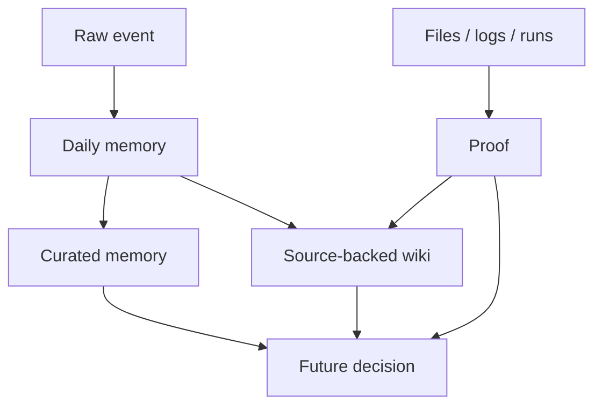

Memory makes an agent feel alive before it makes the agent correct.

That is the trap.

The first time an assistant remembers a preference, the system feels different. It stops being a prompt box and starts becoming a relationship. It knows the user likes terse answers. It knows which files matter. It knows that “today’s posts” probably means the dated drafts in `_posts/`.

That continuity is valuable. It is also dangerous if memory starts acting like truth.

## Memory preserves what happened

A memory file can say what the assistant saw, what the user said, what decision was made, or what outcome seemed true at the time.

That is not the same as proving the world.

A note like this is useful:

```text
Chan said the premise-level rewrites were drastically improved.
```

It records a real preference signal. Future writing work should use it.

A note like this is riskier:

```text
The new pipeline is fixed.
```

Fixed how? Verified by what? Against which failures? For how long?

The first memory preserves a source event. The second turns a moment into doctrine.

Agents are especially prone to that move because compression feels like understanding. A daily note becomes a summary. A summary becomes a preference. A preference becomes a rule. A rule becomes something the next session obeys without knowing where it came from.

That is how guesses fossilize.

## The layers should stay separate

A healthier system separates continuity from truth.



Raw memory answers: what happened?

Curated memory answers: what seems worth carrying forward?

A wiki or durable project page answers: what do we believe, and what sources back it?

Proof answers: what can we point at outside the model?

Those are different questions. Mixing them makes the assistant smoother and less trustworthy.

## The failure mode

The failure is subtle.

The assistant does not usually invent a giant false memory out of nowhere. More often, it preserves a soft conclusion too hard.

A user says a draft is better. The memory becomes “this workflow works.” A tool ran once. The memory becomes “this integration is set up.” A cron was created. The memory becomes “this is being monitored,” even after the job should have exited. A principle was discussed. The memory becomes a new hierarchy the user never endorsed.

That last one is not hypothetical in spirit. It is the kind of drift a personal agent has to resist.

The model wants coherence. Memory supplies coherence. Truth often requires friction.

## Provenance is the antidote

The fix is not to avoid memory.

The fix is to keep provenance close.

A useful memory entry should preserve the shape of the evidence:

- who said it
- when it happened
- which artifact changed
- which command or run verified it
- whether the claim was observed, inferred, or merely planned

For many lightweight preferences, a plain note is enough. If the user says they like a title, write that down. If they say a rewrite improved, write that down.

For operational claims, memory needs more discipline. “Deployed” should point to a commit, run, URL, or deploy status. “Tested” should point to output. “Running” should point to a process, cron job, task id, or session. “Blocked” should name the missing input or permission.

Otherwise the next assistant inherits confidence without evidence.

## Memory should be easy to correct

A personal agent also needs correction paths.

If the user says, “that was not my principle,” the system should not defend the memory. It should update it. If a source-backed page is stale, the system should mark it stale. If a preference was inferred too aggressively, the system should downgrade it.

The best memory systems are not just good at remembering. They are good at being corrected.

That matters because personal memory is intimate. It contains taste, workflow, relationships, projects, frustrations, and half-formed ideas. The assistant is a guest in that space. It should not turn every remembered fragment into law.

## The tradeoff

This makes memory less magical.

Instead of one beautiful, always-current self-story, you get layers: raw notes, curated memories, wiki pages, logs, task files, artifacts, and receipts. Some of them disagree. Some of them are stale. Some of them need a source before they can be trusted.

That is annoying.

It is also honest.

Humans work this way too. We remember, misremember, check photos, search messages, ask “wait, did that actually happen?” and revise the story. A good agent should be allowed to do the same, but with better file hygiene.

## The line I want to keep

Memory is continuity, not authority.

It helps the agent stay oriented. It should not let the agent skip verification.

The right question is not “does the assistant remember?”

The right question is: when the memory matters, can the assistant show where it came from?
