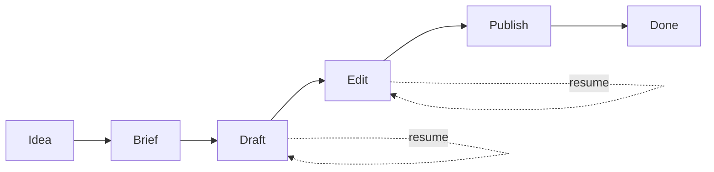

**The problem was never the blank page.**

It was the restart.

## Want / need / get

- **Want:** publish without drama
- **Need:** a workflow that survives interruption
- **Get:** a draft that is easy to resume, edit, and ship

That sounds small. It is not.

Most writing systems fail in the same boring way: they collapse the moment you stop touching them.
You come back later, and the work has turned into archaeology.

You reread.
You remember.
You reconstruct.
Only then do you write.

That is not a workflow. That is a tax.

## The pain is structural

A few failure modes kept showing up:

- drafting and editing happen at the same time
- the next step is not written down
- the finish line holds too many decisions
- the system only works on good days
- interruptions erase momentum instead of preserving it

When that happens, people blame discipline.
Sometimes it is discipline.
More often, it is design.

## The test

I started treating the writing process like a machine that had to survive a crash.

The rule is simple:
- each stage has one job
- each stage leaves behind enough context
- each restart should be cheap

If I can stop in the middle and come back without rebuilding the whole thing, the workflow is working.

## What changed

I stopped asking for one big writing session.
I started asking for a sequence that can be resumed.

That meant:
- writing the next step down
- separating structure from sentence polish
- keeping drafts short enough to hold
- treating “blocked” as a valid state
- publishing only after the work is actually ready

The result is less heroic.
That is the point.

A good workflow is not impressive.
It is quiet.
It keeps moving when I do not.

## The lesson

If a writing system only works when everything goes right, it is not a system.
It is a mood.

The real test is whether it still works when the session breaks.
