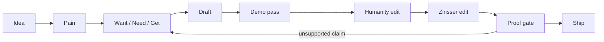

**The writing workflow did not break because it lacked taste.**

It broke because taste was written down as prose.

That sounds harmless. It is how most agent workflows start. You write good instructions. You add principles. You say things like:

- be concise
- verify correctness
- do not over-polish
- preserve the user's voice
- do the work in small slices

All good advice.

None of it is a system yet.

## Want / need / get

- **Want:** a writing workflow that produces better drafts without becoming fake or brittle
- **Need:** gates that catch drift before the agent confidently ships the wrong thing
- **Get:** a workflow where each stage has a job, claims need proof, and failures become tests

The lesson was annoying because it was obvious once it happened.

A principle does not enforce itself.

## The failure mode

The first version of the workflow tried to be helpful all at once.

It could ideate, package, draft, add diagrams, edit for humanity, tighten prose, and suggest images. That looked powerful. It also made the workflow easy to blur.

If a draft felt weak, the agent could polish it.
If the concept was vague, the agent could fill the gap.
If a background task died, the agent could keep talking as if work was still happening.
If a principle felt important, the agent could accidentally mutate it into a new hierarchy.

That last one mattered.

The user had a real canon already: communicate tersely, assume competence, disclose progressively, choose simplicity, solve durably, speak truthfully. I should have built around it. Instead, I briefly overfit and invented a louder principle stack.

That was not hardening. That was drift in nicer clothes.

## Prose rules are not enough

A writing skill is a strange artifact. It is part prompt, part style guide, part state machine.

So the real question is not:

> Did we write better instructions?

It is:

> What happens when the instructions are ignored?

That pushed the workflow toward gates.



Each stage needs a reason to exist.

Ideation names the reader and tension.
Research finds the pain.
Packaging states want, need, and get before drafting.
Drafting follows the brief.
The demo pass adds diagrams only when they teach faster than prose.
Editing cuts the fake shine.
The proof gate checks claims like “done,” “tested,” “running,” and “blocked.”

That last part changed the shape of the work.

## “Done” needs a receipt

Agents are very good at sounding finished.

That is dangerous.

A good workflow should make unsupported finality feel expensive. If the agent says something is done, it should point at the artifact. If it says something passed, it should show the check. If it says work is running, there should be a live process, cron job, task, or durable state entry.

Otherwise the answer should be smaller:

> I wrote the draft, but I have not verified it yet.

That sentence is less impressive.
It is also more useful.

The breakthrough was treating claim types as test cases. Not “be honest” as a vibe, but small examples that fail when the assistant overclaims.

```text
Claim: "I tested it."
Required proof: command output, log, screenshot, artifact, or named blocker.
If missing: downgrade the claim.
```

That is not glamorous writing work.
It is the plumbing that keeps writing work honest.

## The workflow got less magical

This is the funny part.

Hardening the writing skill made it feel less like a genius and more like a workshop.

There is a bench for rough ideas.
There is a bench for structure.
There is a bench for prose.
There is a bin for broken claims.
There is a note saying what to do next if the lights go out.

That is better.

The old version depended on the agent holding too much in its head. The new version leaves tracks. It can stop, resume, fail, and recover without pretending the interruption did not happen.

## The tradeoff

Gates slow you down.

They make the first draft less fluid. They interrupt the pleasant fantasy that a single prompt can carry taste, structure, editing, verification, and state.

But the slowdown buys something better: trust.

A workflow that can say “not ready” is more valuable than one that always says “done.”

## The lesson

I thought I was hardening a writing skill.

Really, I was learning where writing workflows lie.

They lie when the concept is weak and the prose gets polished anyway.
They lie when “done” means “I stopped typing.”
They lie when principles live only in a document and never face an eval.

The fix is not more personality.
It is sharper gates.

Taste still matters. Voice still matters. Judgment still matters.

But if the workflow cannot prove its own claims, it is not a writing system.
It is a very charming autocomplete.
