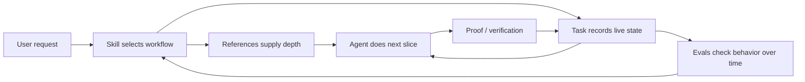

---

## layout: post
title: "Skills Are Instructions. Tasks Are Receipts."
date: 2026-05-01
description: "Reliable agents need separate surfaces for reusable behavior, live work, supporting knowledge, and tests."
tags: [agents, skills, evals, workflow]

A better agent is not a bigger prompt.

That is the tempting fix. If the agent forgot a rule, add the rule. If it skipped a step, add the step. If it claimed work was done without proof, add a sterner sentence about proof.

This works for a while. Then the prompt becomes a junk drawer: personality, tool rules, project doctrine, half-finished tasks, examples, warnings, preferences, and one angry note from the last time the agent lied by accident.

The problem is not that instructions do not matter. They matter a lot. The problem is that different kinds of instruction have different jobs.

If you put them all in one place, you get an agent that can recite the rules and still lose the work.

The shape that has started to feel right is four surfaces:

- **Skills** teach the agent how to do a kind of work.
- **Tasks** remember what is currently happening.
- **References** hold durable knowledge the skill can consult.
- **Evals** check whether the behavior actually changed.

That sounds like process. It is really plumbing.

## The prompt is not the system

A system prompt can set the contract. It can say how the agent should speak, what tools exist, what safety boundaries matter, and which instructions have priority. OpenAI's prompt engineering guide makes the same point in API terms: higher-priority instructions carry behavior, tone, goals, and examples, and production prompts should be pinned and evaluated as they change.[^openai-prompt]

But the prompt should not be asked to carry every detail forever.

Anthropic's agent guidance lands on a similar lesson from another direction: successful agent systems often use simple, composable patterns, not maximum framework complexity.[^anthropic-agents] The useful part is not the ceremony. It is the separation of concerns.

A personal agent needs that separation even more than a production agent. It lives inside a messy workspace. It writes posts, checks mail, edits files, remembers preferences, runs background jobs, and sometimes comes back after a reset with no emotional continuity and too much confidence.

So the question becomes: where should each kind of truth live?

## Skills are recipes, not memory

A skill is the reusable way to do a class of work.

It should answer: when this kind of request arrives, what procedure should the agent follow? What gates matter? What tools or references should it load? What should it refuse to skip?

OpenClaw keeps the base prompt small by injecting an available-skills list with names, descriptions, and file paths, then asking the model to read the specific `SKILL.md` only when it applies.[^openclaw-skills] That is the right shape. The agent does not need every recipe in its head at all times. It needs to know which recipe to open.

A good skill should not say only:

```markdown
Write a good blog post.
```

It should encode the workflow:

```markdown
1. Identify the reader and stage.
2. Build the voice contract.
3. Package the idea before drafting.
4. Plan the demo before adding it.
5. Draft.
6. Run humanity, Zinsser, and read-aloud passes.
7. Verify before claiming done.
```

The skill is not there to make the model less creative. It is there to keep the model from treating every task as a fresh improvisation.

The failure mode is stuffing live state into the skill. A skill should not say, "currently editing Tuesday's post." That belongs somewhere else. Otherwise the reusable recipe becomes stale the moment the work moves.

## Tasks are receipts, not plans

A task is the live ledger for a piece of work.

It should answer: what is the current goal, what stage is it in, what has been verified, what is blocked, and what is the next smallest action?

OpenClaw's background task docs make a useful distinction: tasks are records, not schedulers. Cron and heartbeat decide when work runs; task records track what happened, when, and whether it succeeded.[^openclaw-tasks]

That distinction matters beyond OpenClaw's built-in task ledger. A local `tasks/write-post.md` file plays the same role for writing work. It should not contain doctrine. It should not become a second skill. It should be a receipt.

Bad task file:

```markdown
Remember to write in a human voice. Use strong verbs. Do research. Be concise.
```

Good task file:

```markdown
Goal: draft post about skills, tasks, references, and evals.
Stage: read-aloud pass.
Done: source references collected; Mermaid diagram included.
Blocked: local Jekyll build unavailable because no Gemfile exists.
Next: run structural grep checks and send draft for review.
```

The receipt prevents the most annoying agent failure: "I am still working on it" when nothing is running, or "done" when no artifact exists.

This is why execution discipline matters. OpenClaw's standing-orders guide reduces it to a plain loop: execute, verify, report. "I'll do that" is not execution. "Done" without verification is not acceptable.[^openclaw-standing]

A task file gives that loop somewhere to land.

## References are libraries, not instructions

References are the durable knowledge a skill can pull in when it needs depth.

They are not always active. They are not necessarily urgent. They are the difference between "follow the writing workflow" and a workflow that has separate guidance for hooks, reader journey, demo policy, editing passes, and taste memory.

This is where a system becomes pleasantly boring. The skill stays short enough to load. The references hold the detail. The task says which part of the workflow is live.




A reference can be a rubric, a checklist, an architectural note, a taste memory, a source summary, or a tiny state machine. The key is that it is consulted by a skill but not confused with the skill.

If you promote every reference into the always-on prompt, you burn attention. If you bury every reference inside the skill, the skill becomes unreadable. If you put references into the task file, the current work state turns into a doctrine swamp.

Separate files are not neatness for neatness's sake. They protect the meaning of each surface.

## Evals are how principles become real

This is the uncomfortable part.

A principle is not stable just because it is written down.

You can tell an agent to verify claims. You can tell it not to invent citations. You can tell it to ask fewer questions, preserve voice, use tools before guessing, keep background work bounded, and never pretend a dead job is alive.

It may obey. It may also obey during the session where you yelled about it, then drift later.

Evals are how you find out.

OpenAI's evals repo says high-quality evals are one of the most impactful things you can do when building with LLMs, because they help you understand how model or prompt changes affect your use case.[^openai-evals] Their graders guide also shows the practical range: exact string checks, similarity checks, model graders, and Python execution.[^openai-graders]

That range matters. Not every behavior needs a judge model. Some things should be boring regex or file checks:

- Did the answer claim "done" without evidence?
- Did the draft include fake citations?
- Did the agent update the task file after a meaningful slice?
- Did it ask a long questionnaire when one assumption would do?

Other things need judgment:

- Did the hook open real tension?
- Did the edit preserve the writer's voice?
- Did the demo teach faster than prose?
- Did the post sound authored, not assembled?

The point is not to eval everything. The point is to eval the failures you keep paying for.

## The four surfaces work as a loop

The clean version looks like this:


| Surface   | Job                  | Failure if missing                          |
| --------- | -------------------- | ------------------------------------------- |
| Skill     | Reusable procedure   | The agent improvises every time             |
| Task      | Live state and proof | Work gets lost or falsely reported          |
| Reference | Durable depth        | The prompt bloats or the skill gets shallow |
| Eval      | Behavioral pressure  | Principles stay aspirational                |


The loop is small:

1. The **skill** chooses the workflow.
2. The **references** provide depth only when needed.
3. The **task** records the current slice and proof.
4. The **evals** catch drift and force repairs.

This also gives you a better debugging question.

When an agent fails, do not only ask, "What sentence should I add to the prompt?"

Ask which surface failed.

- If it did not know the procedure, improve the skill.
- If it lost its place, improve the task state.
- If it lacked detailed guidance, add or fix a reference.
- If it keeps regressing, write an eval.

That is slower than adding one more paragraph to the system prompt. It is also calmer. The fix has a place to live.

## The tradeoff is explicitness

This system is not free.

You now have more files. You have to decide what belongs where. You have to prune stale references. You have to keep tasks short. You have to write evals that test behavior instead of congratulating the existence of markdown.

The payoff is that the agent stops depending on vibes.

Skills make behavior reusable. Tasks make progress inspectable. References make depth available without flooding the prompt. Evals make the whole thing answer to evidence.

That is the role of the four surfaces: not to make the agent more bureaucratic, but to make it less slippery.

A bigger prompt can remind an agent what you wanted.

A better system can tell whether it happened.

## References

[^anthropic-agents]: Anthropic, "Building effective agents" — simple composable patterns, workflow/agent distinction, ground-truth feedback, and stopping conditions. [https://www.anthropic.com/engineering/building-effective-agents](https://www.anthropic.com/engineering/building-effective-agents)
[^openai-prompt]: OpenAI, "Prompt engineering" — production prompts should be pinned and evaled; higher-priority instructions carry behavior, tone, goals, and examples. [https://platform.openai.com/docs/guides/prompt-engineering](https://platform.openai.com/docs/guides/prompt-engineering)
[^openai-evals]: OpenAI Evals repository — evals as a framework for testing LLMs and LLM systems, including custom private evals. [https://github.com/openai/evals](https://github.com/openai/evals)
[^openai-graders]: OpenAI, "Graders" — string checks, similarity graders, score-model graders, and Python graders. [https://platform.openai.com/docs/guides/graders](https://platform.openai.com/docs/guides/graders)
[^openclaw-skills]: OpenClaw docs, `concepts/system-prompt.md`, "Skills" — eligible skills are injected as a compact list with paths, then loaded on demand.
[^openclaw-tasks]: OpenClaw docs, `automation/tasks.md` — tasks are activity records, not schedulers; they track detached work state and terminal outcomes.
[^openclaw-standing]: OpenClaw docs, `automation/standing-orders.md`, "Execute-Verify-Report" — execute the work, verify it, then report what was verified.