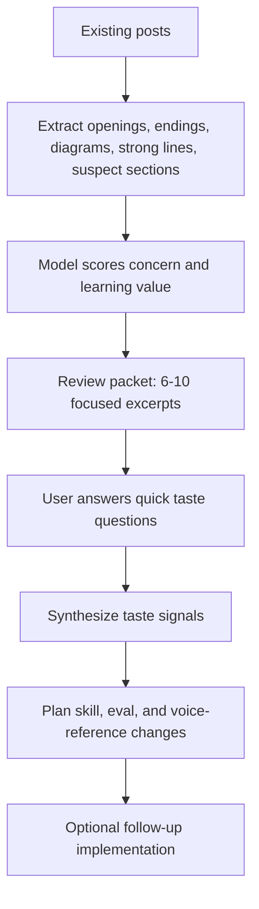

# Taste Eval Loop Plan

## Goal

Create an eval loop that does the reading for you, surfaces only the excerpts where your taste signal matters, and then converts your responses into a plan for improving `write-post`.

The loop should not ask you to evaluate full posts. It should show small, high-leverage excerpts and ask questions like: keep/cut, warmer/colder, too clever/just right, demo earns it/skip it, opening works/does not work.

## Existing Fit

This should build beside the current eval harness rather than replace it:

- Use the post corpus in [`/Users/tars/.openclaw/workspace/_posts`](/Users/tars/.openclaw/workspace/_posts).
- Reuse patterns from [`/Users/tars/.openclaw/workspace/scripts/write-post-eval.py`](/Users/tars/.openclaw/workspace/scripts/write-post-eval.py): model calls, logs, state, task ledger, provider fallbacks.
- Keep the current 21-case `write-post` regression suite in [`/Users/tars/.openclaw/workspace/evals/write-post-cases.json`](/Users/tars/.openclaw/workspace/evals/write-post-cases.json) for behavior checks.
- Add a separate taste loop so subjective review does not pollute deterministic pass/fail evals.

## Proposed Artifacts

Add:

- [`/Users/tars/.openclaw/workspace/scripts/write-post-taste-eval.py`](/Users/tars/.openclaw/workspace/scripts/write-post-taste-eval.py): runner that extracts candidate excerpts, asks the model to rank concern areas, and writes a review packet.
- [`/Users/tars/.openclaw/workspace/evals/write-post-taste-rubric.json`](/Users/tars/.openclaw/workspace/evals/write-post-taste-rubric.json): concern categories and selection rules.
- [`/Users/tars/.openclaw/workspace/logs/write-post-taste/latest.json`](/Users/tars/.openclaw/workspace/logs/write-post-taste/latest.json): machine-readable run output.
- [`/Users/tars/.openclaw/workspace/logs/write-post-taste/latest.md`](/Users/tars/.openclaw/workspace/logs/write-post-taste/latest.md): short human review packet.
- [`/Users/tars/.openclaw/workspace/tasks/write-post-taste.md`](/Users/tars/.openclaw/workspace/tasks/write-post-taste.md): durable state and follow-up plan.
- Later, after your answers: [`/Users/tars/.openclaw/workspace/skills/write-post/references/taste-memory.md`](/Users/tars/.openclaw/workspace/skills/write-post/references/taste-memory.md), a compact voice/taste reference derived from your preferences.

## Concern Categories

The first loop should sample the biggest current uncertainties:

- **Hook truth versus hook cleverness:** is the first sentence genuinely inviting, or just punchy?
- **Personal voice versus abstraction:** should this line use `I`, `you`, or stay system-level?
- **Scaffold leakage:** does the structure feel like an article, or like a workflow transcript?
- **Over-explanation:** does the post keep proving a point after the reader already has it?
- **Demo usefulness:** does a diagram/code/table teach faster than prose, or decorate?
- **Ending quality:** does the final line land, or summarize?
- **Line-to-keep detection:** which strange or compact lines have life and should survive editing?

## Loop Shape

## Review Packet Format

Each item should be small:

- source post and location
- excerpt, usually 1-8 lines
- why the model flagged it
- the concern being tested
- 2-4 answer choices, plus an optional freeform note

Examples:

- Hook: “The happy path is not the automation.”
  Question: Does this feel like a true hook, or does it need more lived friction?
- Demo: a Mermaid diagram from an existing post.
  Question: Does this teach faster than prose, or should the post rely on explanation?
- Ending: “Invisible is not.”
  Question: Does this land, or is it too compressed?

## User Interaction

Do not ask the user to read `latest.md` end-to-end unless they want to.

The agent should take the top 5-8 review items from `latest.json` and present them in chat using structured choices. The user can answer quickly. If the user gives only partial answers, synthesize from the available signal and queue the rest.

## Synthesis Output

After the user responds, produce:

- a short summary of what resonated
- a list of taste rules with confidence levels
- a plan for skill changes, eval changes, or no change
- candidate additions to `taste-memory.md`

Examples of possible resulting rules:

- “Prefer quiet reversal hooks over clever slogans.”
- “Keep compact terminal lines when they feel earned.”
- “Use diagrams only for relationship structure, not for emotional or experiential points.”
- “Do not edit away first-person friction in personal workflow posts.”

## Implementation Steps

1. Add the taste rubric and runner.
2. Run the runner across all 17 posts in `_posts`.
3. Generate `latest.json` and `latest.md` with the highest-signal review items.
4. Present 5-8 items to the user as quick questions.
5. Synthesize answers into a second plan for `write-post` and `taste-memory.md`.
6. Only then modify the writing skill or evals based on what the user actually preferred.

## Guardrails

- Keep subjective taste separate from deterministic regression tests.
- Do not treat one user answer as universal law.
- Prefer pairwise or multiple-choice prompts over open-ended critique.
- Preserve examples of both “resonates” and “does not resonate.”
- Store taste signals with source excerpts so future rules are grounded.
