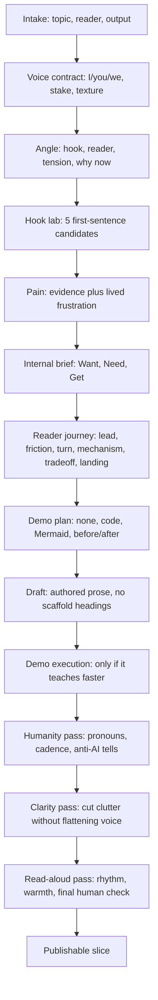

# Write Post Chain Evaluation

## Diagnosis

The current chain is mostly sound for preventing bad drafts, but it has order-of-operations problems for human readability:

- **Voice arrives too late.** In [`/Users/tars/.openclaw/workspace/skills/write-post/SKILL.md`](/Users/tars/.openclaw/workspace/skills/write-post/SKILL.md), `humanity-edit` comes after drafting and demo insertion. That means the draft is first created from structure, then made human afterward. This encourages neutral, article-like prose.
- **Research can erase the speaker.** [`research-pain-points`](/Users/tars/.openclaw/workspace/skills/research-pain-points/SKILL.md) asks for failures, costs, and workarounds, but not the author's stake. That pushes the model toward `users` and `people` instead of `I` and `you`.
- **Want/Need/Get is placed correctly but too dominant.** [`want-need-get.md`](/Users/tars/.openclaw/workspace/skills/write-post/references/want-need-get.md) is now marked as scaffolding, which is good. But the chain still jumps from brief to draft without a transformation step that turns the scaffold into a natural reading journey.
- **Hooks are treated as angle metadata, not as a craft object.** [`ideate-topic`](/Users/tars/.openclaw/workspace/skills/ideate-topic/SKILL.md) asks for a hook, but the chain does not test whether the first sentence is short, inviting, memorable, concrete, or tension-bearing.
- **Demo decisions happen too late as a single step.** [`add-graphs-and-figures`](/Users/tars/.openclaw/workspace/skills/add-graphs-and-figures/SKILL.md) runs after drafting. That is fine for insertion, but the post should know before drafting whether it is building toward a diagram, code block, before/after, or no demo.
- **Zinsser can over-clean.** [`zinsser-editing`](/Users/tars/.openclaw/workspace/skills/zinsser-editing/SKILL.md) correctly says to keep voice alive, but because it happens after the humanity pass, it can accidentally remove warmth, pronouns, or useful mess.

## Hook Research

Two useful principles came out of the hook sources:

- Cole Schafer's hook sentence framing: a hook is one short sentence that grabs attention and gives the reader a reason to keep reading. His practical bar is short, simple, and immediate.
- The Wisconsin hook handout broadens the pattern library: quote, anecdote, question/riddle, scene or in-medias-res opening, interesting fact/definition, and misconception reversal.

For this skill, the strongest hook categories are probably:

- **Lived-friction hook:** "I kept coming back and reconstructing the work."
- **Reader-pain hook:** "You do not have a writing problem. You have a restart problem."
- **Misconception hook:** "The blank page was not the hard part."
- **Scene hook:** "The draft was open. I still had no idea where I had left off."
- **Mechanism hook:** "A good writing workflow leaves breadcrumbs."

The risk: hook research can push the model toward gimmicks. The rule should be: use the hook to open tension, not to perform cleverness.

## Proposed Chain

Use a two-track chain: structure and voice move together from the start.

## Concrete Skill Changes

- Add a **Voice Contract** stage to [`write-post/SKILL.md`](/Users/tars/.openclaw/workspace/skills/write-post/SKILL.md): before ideation or packaging, decide whether the post should use `I`, `you`, `we`, or mostly third-person, and why.
- Add a **Hook Lab** stage after angle selection and before the brief: generate 3-5 first-sentence candidates, each tied to a hook type and reader tension.
- Add an **Author Stake** field to [`research-pain-points/SKILL.md`](/Users/tars/.openclaw/workspace/skills/research-pain-points/SKILL.md): capture what the author saw, felt, tried, or learned when available.
- Add a **Reader Journey / Beat Sheet** reference under [`skills/write-post/references/`](/Users/tars/.openclaw/workspace/skills/write-post/references/): translate Want/Need/Get into natural sections without literal scaffold headings.
- Create a **Hooks reference** under [`skills/write-post/references/`](/Users/tars/.openclaw/workspace/skills/write-post/references/) with hook types, pass/fail checks, and examples tuned to builder posts.
- Split demo handling into two decisions: early **demo plan** before drafting, later **demo execution** after the draft.
- Add a final **read-aloud / human readability gate** after Zinsser: restore pronouns, rhythm, concrete examples, and owned sentences if clarity edits made the piece sterile.

## Eval Updates

Extend [`/Users/tars/.openclaw/workspace/evals/write-post-cases.json`](/Users/tars/.openclaw/workspace/evals/write-post-cases.json) with cases that verify:

- Personal posts choose `I` when appropriate.
- Reader-facing posts use `you` for pain and payoff when useful.
- Hook candidates are short, simple, concrete, and tension-bearing.
- The final draft opens with a real hook, not a generic summary sentence.
- Drafts translate Want/Need/Get into natural prose.
- Zinsser edits do not remove pronouns or lived texture.
- Demo planning happens without forcing a decorative demo.

## Recommendation

The highest-leverage change is not another editing rule. It is moving humanity earlier: before the first draft, the skill should know who is speaking, who is being addressed, and what lived friction makes the post worth writing. Then the editing passes preserve that voice instead of trying to reattach it later.
